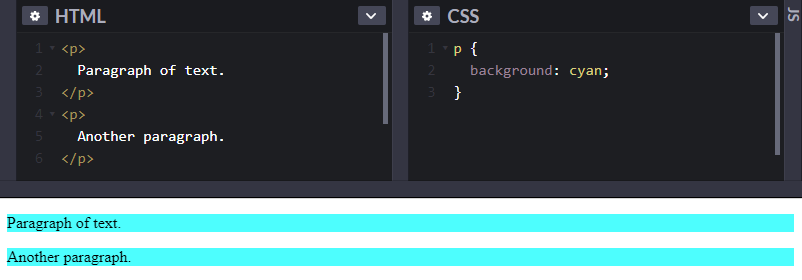
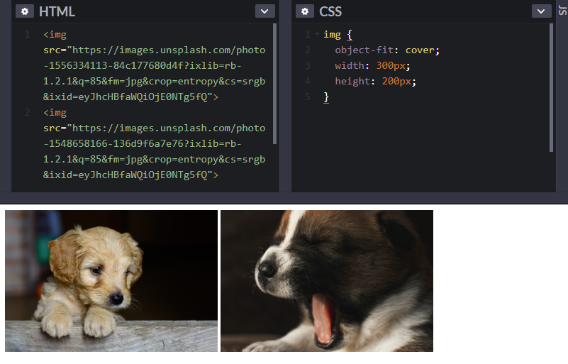
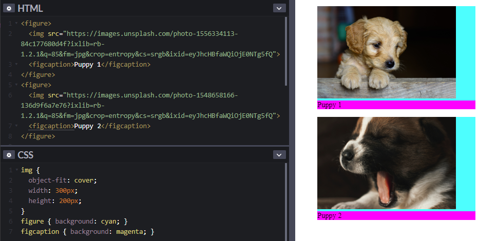
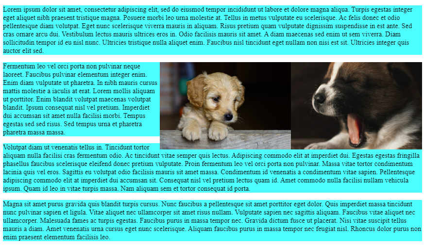
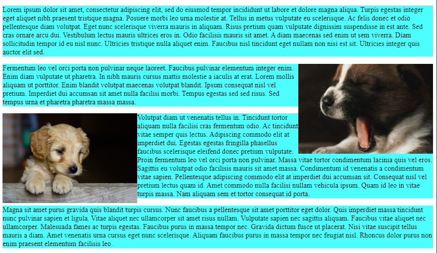
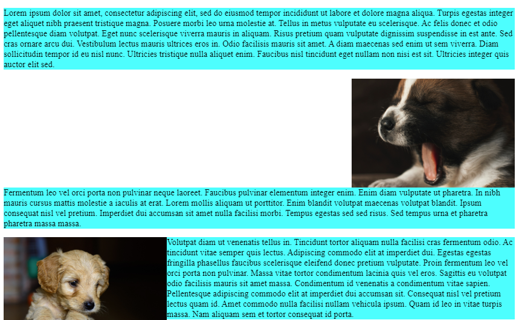

# TECH3015 Lecture 08

2019-2020

---

## MODULE TUTORS

- **Thom Corah** (Module Leader)  
Location: GH6.62  
Email: tcorah@dmu.ac.uk  
Tel: 0116 207 8088

- **Fania Raczinski** (labs)  
Email: fania.raczinski@dmu.ac.uk

- **Dave Everitt** (lectures)  
Email: deveritt@dmu.ac.uk


## MODULE STRUCTURE

- **Term 1, Assignment 1:** IA, design and wireframes, accessibility, interaction design, graphic design, **recap web languages**
- **Term 2, Assignment 2:** HTML5, CSS3, JavaScript ES6, APIs, animation, HTML validation, accessibility testing, Responsive Web Design and code, Progressive Web Apps


## ASSIGNMENT DEADLINES

- **Assignment 1 (40%):**  
midday (12pm) on Friday 13 December 2019

- **Assignment 2 (60%):**  
midday (12pm) Friday 3rd April 2020

[Full marking criteria for Coursework 1](https://daveeveritt.github.io/TECH3015/coursework-01.html#marking-criteria) (Assignment 2 criteria to follow)

---

## WHERE WE ARE

th

---

## Layout

gjghj

---

## Natural/Normal Flow

- all html elements are either **block** or **inline**
- inline elements wrap lines, just as text would
- you can change the **display** property of elements
- if unsure inspect element in the browser


### Block-level elements

> "A block-level element always starts on a new line and takes up the full width available (stretches out to the left and right as far as it can)." [*]<!-- .element: data-preview-link -->

```css
div {
  display: block;
}
```

E.g. `<header>,<nav>,<div>,<section>,<h1>,<p>,<ul>,<form>,<table>,<figure>,<footer>`

[*]: https://developer.mozilla.org/en-US/docs/Web/HTML/Block-level_elements


### Inline elements

> "An inline element does not start on a new line and only takes up as much width as necessary." [*]

```css
span {
  display: inline;
}
```

E.g. `<a>,<span>,<code>,<button>,<strong>,,<video>,<input>`

[*]: https://developer.mozilla.org/en-US/docs/Web/HTML/Inline_elements


### Display Property

There are many different [display types](https://developer.mozilla.org/en-US/docs/Web/CSS/display):

- `none, inline, block, inline-block, table, list-item, flex, grid`
- **flex** and **grid** are for slightly more advanced layouts

[W3Schools Try "The Display Property"](https://www.w3schools.com/cssref/tryit.asp?filename=trycss_display)

[W3Schools Try "Inline-Block"](https://www.w3schools.com/css/tryit.asp?filename=trycss_inline-block_span1)


### Examples

**Inline**  
[](https://codepen.io/faniae/pen/zYYyMEo)


**Block**  
[](https://codepen.io/faniae/pen/JjjweyN)


**Inline + Block**  
[](https://codepen.io/faniae/pen/yLLGRMx)


**Inline-Block**  
[](https://codepen.io/faniae/pen/dyywQBj)


**Images**  
[](https://codepen.io/faniae/pen/GRRPwrG)


**Figures**  
[](https://codepen.io/faniae/pen/WNNLaYg)

---

## Customising Flow

- by default items are in natural flow of html elements
- take them out of that flow using these options:
  * **floating** or
  * **positioning**.

[MDN In Flow and Out of Flow](https://developer.mozilla.org/en-US/docs/Web/CSS/CSS_Flow_Layout/In_Flow_and_Out_of_Flow)


### Floating Elements

> "places an element on the left or right side of its container, allowing text and inline elements to wrap around it" [*]

- turns inline elements into **block**-level elements
- `left, right, none`

```css
img {
  float: right;
}
```

[*]: https://developer.mozilla.org/en-US/docs/Web/CSS/float


### Float Examples

**float 2 images right**  
[](https://codepen.io/faniae/pen/PooXXxN)


**float images differentely**  
[](https://codepen.io/faniae/pen/oNNJmNv)


**clear floats**  
[](https://codepen.io/faniae/pen/GRRPzpj)


### Positioning Elements

TODO

---

## Examples / Refernces

https://internetingishard.com/html-and-css/responsive-design/

https://www.globalreach.com/blog/2018/01/08/5-timeless-website-layouts-and-when-theyre-most-effective

---

## WHAT YOU WANT NEXT

What do you want to cover next week? E.g.

- list here

---

## FINAL QUESTIONS?

No crowding around the  
podium after, please!
